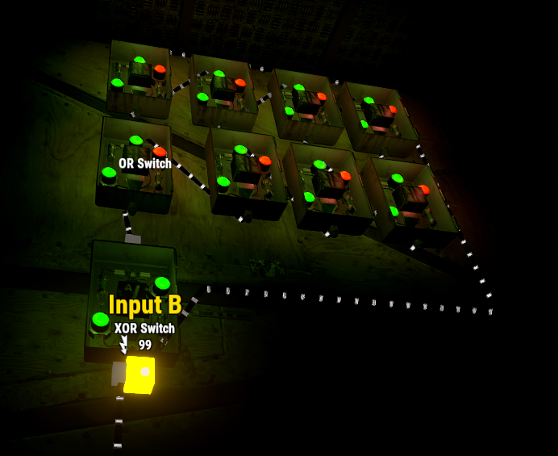
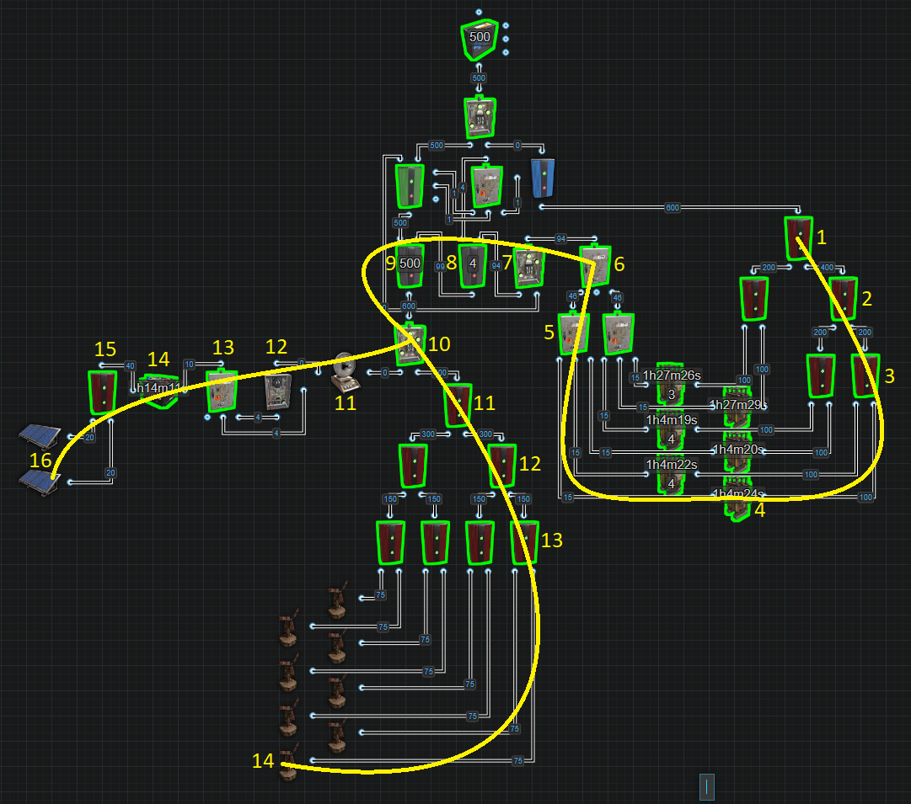

# The Structure of a Base Circuit

All circuits for a base follow the same basic structure. It
doesn't matter if the base has 1 circuit or more, they all contain 4
main parts with a 5th part that does not have a static location. We have
the Power Source, Battery Backup, Distribution, End Devices/Circuits and
the 5th, Destruction Detection. Using the following flow chart we can
help illustrate this.

Moving top to bottom, every circuit needs a power source. You have 3
choices, Windmills, Solar Panels or Small Generators.

We then take our source power and feed it to a Battery Backup. You have
2 choices, the Inline or Bypass(Nih Core). Either way, you must ensure
you are supplying enough power to keep your batteries charged.

From the battery backup, we will then need to distribute the power to
the different systems in the base. There are 3 options, a Fixed or
Dynamic Bus or a Configure Siphon.

If you are working with Inline Battery Backup, you want to minimize a
battery’s Active Usage. If you are working with a Bypass Battery Backup,
you want to maximize the use of Consumable Power.

The End Devices and Circuits are your turrets, lights, cameras, farms,
sensor grids, ect. The Destruction Detection system should be included
in most circuits and if limited to one, placing one after the battery
backup is probably the best option.

---

# Battery Active Usage Vs Actual Power Consumed

The simple explanation is, Active Usage is the amount of power the
battery is draining by. When you look at the battery with a wire tool,
you will see Active Usage. It is reasonable to think that the number you
see is the amount of power your circuit is currently consuming, but it’s
not always the case. Even when some components are turned off and not
consuming power, they still add to a battery's active usage. Power
Consumed is the reduction of available power after passing through a
component. An electric heater consumes 3, if 100 goes in we get 97
coming out. For almost all components, the consumed power = active
usage, this is a 1:1. The electrical branch is the only component that
does not register an active usage for itself and only for what is
branched out.

[Active Usage VS Power Consumption](https://www.rustrician.io/?circuit=f6b1665cb24abf785169b230e064016a)

---

# Short Circuit / Max Depth

This is a single message that is displayed for 2 different errors. At
the time of creating this section, XOR Switches did not consume any
power which is why you will see them used in the pictures. The pictures
might get remade in time but power consumption is not important when
discussing and understanding this error.

## Short Circuit

A short circuit happens when you have power feeding back into itself,
AKA, a loop.  

Why would you do this? You wouldn’t. In the past, batteries functioned
differently and there was a need to create the “Infinite Power Loop”.
Today, batteries have something called “Active Usage”. This breaks the
infinite loop and eliminates a need for it to exist.

You can circumvent a short circuit by increasing the number of
components in the loop to be 9 or greater.

In the next picture we show a battery feeding power back into
itself.

There is no reason to do this anymore. There was a time when batteries
could only exist in 1 state at a time. They were either charging or
discharging and when they were discharging, they were always doing it at
their max. Back then, people found a way to use the extra power and send
it back to the battery. For example, a large battery was always
outputting 100 power whereas today, they calculate an active usage and
only drain the amount of power a circuit needs, up to 100. Today, if the
circuit only needs 50, the battery only gives 50.

The other thing to note is batteries also cause an active usage. For a
large battery, it is 400, so in the above loop, you are forcing a max
drain on the battery. There is no advantage to this.

## Max Depth

Maximum Depth is referring to the number of components between your
power source and the  Root Combiner. A Max Depth error will occur when
we exceed 16 components.

It is important to understand this mechanic and how to calculate it.
This becomes important when combining multiple power sources including a
battery backup with multiple combined batteries. If you experience this
error, to calculate the depth of a circuit, we start with the last Root
Combiner or the combiner that is furthest away from the power source and
count the number of components power must pass through all the way back
to the power source. This limits where in a circuit you can use Root
Combiners.

The below images are 2 ways root combiners can be stacked. The group on
the left is known as pyramid stacking and the group on the right is
known as a daisy chain. While both groups are possible, you can see that
the group on the left is only 4 components deep whereas the right side
is 8 deep. This is important when working with a large amount of
centralized power because you can quickly use up the depth and then not
be able to have the number of batteries you want or need.

In this next image, we have 8 Windmills combined into a Nih Core with a
battery backup containing 6 Large Batteries. This circuit has a total
depth of 13 components. The trick to counting depth is counting the
components in the longest route from the last Root Combiner, \#1 back to
the Windmill, \#13.  

In the next example, we have 2 isolated power sources. The first source
is the cluster of Windmills. The second is the combined Solar Panels for
the Component Destruction Detector. This means that we have 2 paths we
must consider when calculating the depth. The first path to look at is
the one that goes from the Root Combiner \#1 back to the Windmill \#14.
This path is the main power path. The second path goes from Root
Combiner \#1 back to the Solar Panel \#16. If one of these paths exceed
the Max Depth limit of 16 components, you will start to see the error
message at Root Combiner \#1.

The next image shows a Max Depth using an equal number of Windmills and
Batteries with a Nih Core.

---

# Circuit Delay and Power Flow

NEEDS WORK

A simple explanation for now:

Circuit delay is the amount of time it takes power to pass from one
component to another.

Power flow is the path electricity takes through a circuit.

---

# Useful Circuits

## Basic

[Logic Gates](https://www.rustrician.io/?circuit=64810508602bc0cd1baa954d1a1da539)

## Advanced

[Destruction Detection](https://www.rustrician.io/?circuit=076b71d674c3c1f90deb438d241a8f9d)

---
