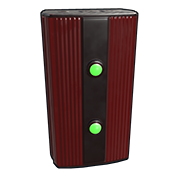

# Power Distribution

---

Power distribution is one of the most important things to know and
understand when it comes to electricity.  
There are many ways to produce, store and distribute power for your circuits.  
This section breaks down the components used for distribution and the different types of distribution circuits known as a power bus.  
It covers the different types of battery backup systems.  
It covers the difference between the amount of power a circuit consumes versus what a battery thinks it is consuming, aka active usage.  
This section also covers the theory behind circuit and location centralization, decentralization and hybridization.  
It covers the game mechanics behind circuit delay and power flow as well
as the error message, short circuit/max depth.

---

# Root Combiner

| | |  
|-|---|  
Identifier          | -458565393
Description         | Combining power from power sources
Crafting Recipe     | 75 Metal Fragments
Recycles Into       | 38 Metal Fragments
Stack Size          | 5
Workbench Required  | Level 1
Research Table Cost | 75 Scrap
Hit Points          | 200
Where To Find       | Arctic Scientist, Cargo Ship Scientist, Crate, Excavator Scientist, Military Base Scientist, Oil Rig Scientist, Patrol Scientist, Sunken Chest, Tunnel Dweller, Underwater Dweller, Underwater Lab Blue Crate
Inputs/Outputs      | Root Power 1, Root Power 2 / Combined Power Out
Active Usage        | 1
Power Consumption   | 0rW
Power Output        | Same as input
Despawn Time        | 20 minutes

Notes:

- These allow you to combine Power Sources and batteries to produce
  higher amounts of available power. Power Sources are Wind Turbines,
  Large Solar Panels and Small Generators
- It does not consume any power but it will register 1 active usage on a
  battery
- Can be placed on all building surfaces
- They have a shared error message, ‘Short Circuit/Max Depth’, and that
  has [its own section](concepts.html#short-circuit-max-depth) breaking it down.
- also see [Root combining batteries](storage.html#root-combining-batteries) as it have down side
  and isnt recommended in most cases,

---

# Electrical Branch

| | |  
|-|---|  
Identifier          |  -1448252298
Description         | Branching power off from the main line by a set amount
Crafting Recipe     | 75 Metal Fragments
Recycles Into       | 38 Metal Fragments
Stack Size          | 5
Workbench Required  | Level 1
Research Table Cost | 75 Scrap
Hit Points          | 200
Where To Find       | Arctic Scientist, Cargo Ship Scientist, Crate, Excavator Scientist, Military Base Scientist, Oil Rig Scientist, Patrol Scientist, Sunken Chest, Tunnel Dweller, Underwater Dweller, Underwater Lab Blue Crate
Inputs/Outputs      | Power In  / Branch Out, Power Out
Active Usage        | 0 + Branch Out
Power Consumption   | 1rW + Branch Out
Power Output        | Branch Out is the amount you configure it to. Power Out is the remaining power.
Despawn Time        | 5 minutes

Notes:

- These will consume 1 power that passes through it but not register on
  a battery's active usage for itself
- Can be configured by pressing `E` while looking directly at the
  Branch.
- 2rW is the minimum you can Branch Out
- What you set the Branch Out to will be the amount to register on a
  battery’s active usage and will always consume that much power even if
  the components past it are disabled. More explained in ‘link to
  battery active usage vs actual power usage’
- When an Electrical Branch sends power out, it will first send power
  through Power Out then send power through Branch Out. Check out the
  section on Circuit Delay and Power Flow.
- Can be placed on all angled surfaces.

---

# Splitter

| | |  
|-|---|  
Identifier          |  -563624462
Description         | Splitting power evenly between up to 3 outputs
Crafting Recipe     | 100 Metal Fragments
Recycles Into       | 50 Metal Fragments
Stack Size          | 5
Workbench Required  | Level 1
Research Table Cost | 20 Scrap
Hit Points          | 500
Where To Find       | Arctic Scientist, Cargo Ship Scientist, Crate, Excavator Scientist, Military Base Scientist, Oil Rig Scientist, Patrol Scientist, Sunken Chest, Tunnel Dweller, Underwater Dweller, Underwater Lab Blue Crate
Inputs/Outputs      | Power In  / Power Out 1, Power Out 2, Power Out 3
Active Usage        | 1
Power Consumption   | 1rW
Power Output        | Input amount divided by the number of used outputs, minus 1
Despawn Time        | 5 minutes

Notes:

- When the Splitter receives power it does not pass power through all
  connected outputs at the same time. Power outputs in the order of
  Output 1, Output 2 then Output 3. Check out the section on Circuit
  Delay and Power Flow.
- Can only be placed on vertical walls
- When an output is destroyed, it will redistribute power between the
  remaining outputs.
- Outputs can connect to the inputs of Root Combiners

---
