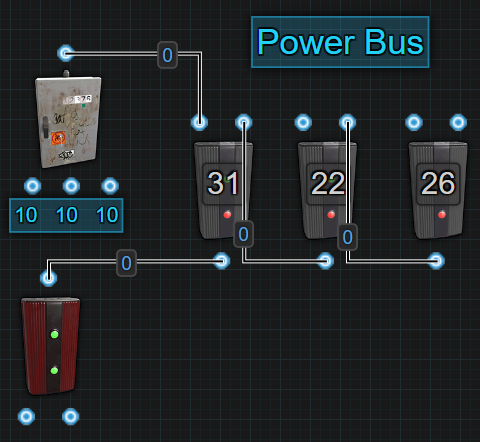
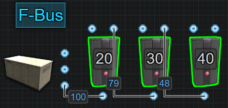
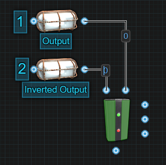
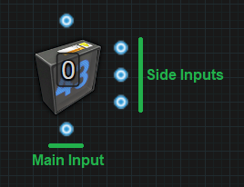
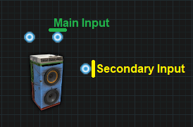

# Power Distribution

---

# What is a Power Bus?

Power always needs a way to get from point A to point B. That could be from a Wind Turbine to an Auto Turret or from a Solar Panel to a Light. A power bus is a single or group of components with the sole purpose of directing the flow of electricity to different circuits that perform specific tasks such as auto turrets or lighting. This is a lot like the breaker panel or fuse panel you have in your home for your electricity. Each breaker or fuse is dedicated for a specific room or purpose, like the fridge, furnace, bedrooms or garage. These breakers or fuses limit how much power each circuit can use and in Rust, this is no different. Instead of breakers or fuses, its Electrical Branches and Splitters.

 The most difficult part of deciding how to distribute power is knowing how the components that are specifically made for this job function. There are 2 main components, the Electrical Branch and the Splitter and its recommended reading about them specifically in the Power Distribution section under Component Details. There are 3 types of power buses, fixed, dynamic and configurable. 

---

## Fixed Bus (F-Bus)

A fixed bus, known as an F-Bus, is when you dedicate a specific amount of power per output. This can be just a single Electrical Branch or a group of them. This type of power bus always consumes the amount of power each output is set to, even if nothing is attached to Branch Out. This will affect Inline battery backups by forcing an Active Usage and it will affect a bypass battery backup by always consuming power, even when the components connected to Branch Out are offline. 

A fixed bus is an easy way to build in priorities and a bit of security. The first Electrical Branch has the highest priority because it's the first to get power and in the event that power levels start falling, it will be the last branch to lose power. The security comes from knowing that if 50% of the power supply disappears, only some branches will lose power and not all. 

---

## Dynamic Bus (D-Bus)

A dynamic bus, known as a D-Bus, is when the components evenly distribute power between all connected outputs. This can be just a single Splitter or a group of them and the only control over the amount of power available at each output is the amount of power that is put into it. 

This is great when the component or circuit attached to each output requires the same amount of power. It is a power efficient way to supply the same amount of power to multiple components or circuits. When using a bypass battery backup, it can free up some power to be used somewhere else. When using an Inline battery backup, only the Active Usage from the Splitter is forced onto the battery. Only when the components connected to each output are online will their Active Usage be reflected on the battery. This is good in situations where a player wants to use a Switch to turn things off before they logout. 

If an output gets destroyed, the system will evenly redistribute power between the remaining outputs. The drawback would be that if the incoming power drops too low to support the connected outputs, everything will stop working or at least those that require the full amount of power that was previously present.

---

## Configure Siphon

A configure siphon, known as a C-Bus, is a bypass distributor that is only active when required. The idea is only when power is needed will the C-Bus become active, otherwise the power just passes through. Set the Electrical Branches in the siphon to a specific amount of power to only be used when the siphon is active. There are multiple versions of the siphon based on if there is a need for manual or automatic operation and what kind of battery backup is being used. 

All of them are centered around the Memory Cell. The Memory Cell has 2 outputs, Output and Inverted Output. One output is called the Main Line (aka the bypass) and the other output goes to the Circuit that we want to power. The Main Line is the default path the electricity takes when the siphon is not active. It will pass from a Memory Cell to an OR Switch and out. The Circuit path is the route electricity will take when the Memory Cell gets triggered. It gets sent to an Electrical Branch that is configured to an amount of power the circuit needs while the remainder gets sent off to the OR Switch and back onto the Main Line to continue powering the circuits past it. While this is the general concept, let's get a little more specific.

There are **2 categories** of Configure Siphons. There is the **Auto Reset** which will automatically turn itself on when an input is received and off when the input signal is removed. The second is **Manual** which requires a player to manually turn it on and off. Within each of these categories there are **2 types**. There is the **Standard C-Bus** which is to be used in a circuit that uses a bypass battery backup like the [Nih Core](powerstorage.html#nih-core). The second type is the Blocked C-Bus meant to be used in a circuit that uses an [Inline](powerstorage.html#nih-core) battery backup. The reason 1 has a Blocker is because of the nature of components and a battery's Active Usage. The Blocker has the ability to hide Active Usage from a battery when it is actively being blocked. Read more about that in the section titled [ Battery Active Usage vs Actual Power Consumption ](powerstorage.html#battery-active-usage-vs-actual-power-consumed) located in Power Storage under Concepts.

Now to get very specific. Starting with the Auto Reset siphons, these by default will send power out the Inverted Output(left output). Power will be passed to an OR Switch then out. In the Blocked version, power gets passed to an Electrical Branch that is used to block a Blocker before passing power to the OR Switch and out. ‘Out’ could be another siphon, another type of power bus or whatever. A HBHF Sensor is used as the input source but it doesn’t have to be. All that’s needed is a constant source of power to keep the siphon active. When the sensor outputs power, it will ‘SET’ the Memory Cell. This will force the Memory Cell to flip outputs and send power through Output(right output). From Output, power will be sent to an Electrical Branch configured to +2 over the amount of power your circuit will need. The leftover power will pass through Power Out and merge back into the Main Line. The power coming out of Branch Out will go to another Electrical Branch that will be set to the amount of power the circuit actually needs. The reason for +2 is because 1rW is needed for the second Electrical Branch itself and 1rW needs to be sent out Power Out to ‘RESET’ on the Memory Cell. In the blocked version, a Blocker was added before the first Electrical Branch so it can hide the Active Usage caused by the Electrical Branches from a battery. When the sensor stops sending power to ‘SET’, the power going to ‘RESET’ will force the Memory Cell to flip outputs back to Inverted Output and return power to the Main Line. In the blocked version, because of the Electrical Branch on the Main Line, the Blocker will get blocked again to hide the Active Usage.

The Manual siphons function in a very similar way only instead of using ‘SET’ or ‘RESET’ on the Memory Cell, ‘TOGGLE’ is used instead. Everytime ‘TOGGLE’ receives power, the Memory Cell will flip outputs. A Red Button is used in the pictured examples but it doesn't have to be. When it comes to which output on the Memory Cell is the Main Line or the Circuit line, it really doesn't matter because there is the ability to manually control which output power is actively passing through. 

In all the examples we have used Counters at each output. This is
only to show how much power each C-Bus costs to not be active.
[Here is a Rustrician BP link to explore the C-Bus more. ](https://www.rustrician.io/?circuit%3D71c12c6e40d98dea32fb463a773b2f42)

---

# Short Circuit / Max Depth

This is a single message that is displayed for 2 different errors. At
the time of creating this section, XOR Switches did not consume any
power which is why you will see them used in the pictures. The pictures
might get remade in time but power consumption is not important when
discussing and understanding this error.

## Short Circuit

A short circuit happens when you have power feeding back into itself,
AKA, a loop.  

Why would you do this? You wouldn’t. In the past, batteries functioned
differently and there was a need to create the “Infinite Power Loop”.
Today, batteries have something called “[Active Usage](powerstorage.html#battery-active-usage-vs-actual-power-consumed)”. This breaks the
infinite loop and eliminates a need for it to exist.

You can circumvent a short circuit by increasing the number of
components in the loop to be 9 or greater.

In the next picture we show a battery feeding power back into
itself.

There is no reason to do this anymore. There was a time when batteries
could only exist in 1 state at a time. They were either charging or
discharging and when they were discharging, they were always doing it at
their max. Back then, people found a way to use the extra power and send
it back to the battery. For example, a large battery was always
outputting 100 power whereas today, they calculate an [Active Usage](powerstorage.html#battery-active-usage-vs-actual-power-consumed) and
only drain the amount of power a circuit needs, up to 100. Today, if the
circuit only needs 50, the battery only gives 50.

The other thing to note is batteries also cause an active usage. For a
large battery, it is 400, so in the above loop, you are forcing a max
drain on the battery. There is no advantage to this.

---

## Max Depth

Maximum Depth is referring to the number of components between your
power source and the  Root Combiner. A Max Depth error will occur when
we exceed 16 components.

It is important to understand this mechanic and how to calculate it.
This becomes important when combining multiple power sources including a
battery backup with multiple combined batteries. If you experience this
error, to calculate the depth of a circuit, we start with the last Root
Combiner or the combiner that is furthest away from the power source and
count the number of components power must pass through all the way back
to the power source. This limits where in a circuit you can use Root
Combiners.

The below images are 2 ways root combiners can be stacked. The group on
the left is known as pyramid stacking and the group on the right is
known as a daisy chain. While both groups are possible, you can see that
the group on the left is only 4 components deep whereas the right side
is 8 deep. This is important when working with a large amount of
centralized power because you can quickly use up the depth and then not
be able to have the number of batteries you want or need.

In this next image, we have 8 Windmills combined into a Nih Core with a
battery backup containing 6 Large Batteries. This circuit has a total
depth of 13 components. The trick to counting depth is counting the
components in the longest route from the last Root Combiner, \#1 back to
the Windmill, \#13.  

In the next example, we have 2 isolated power sources. The first source
is the cluster of Windmills. The second is the combined Solar Panels for
the Component Destruction Detector. This means that we have 2 paths we
must consider when calculating the depth. The first path to look at is
the one that goes from the Root Combiner \#1 back to the Windmill \#14.
This path is the main power path. The second path goes from Root
Combiner \#1 back to the Solar Panel \#16. If one of these paths exceed
the Max Depth limit of 16 components, you will start to see the error
message at Root Combiner \#1.

The next image shows a Max Depth using an equal number of Windmills and
Batteries with a Nih Core.

---

# Circuit Delay and Power Flow

## Circuit Delay

Circuit Delay at its most basic, is the amount of time it takes power to pass from one component to another. The amount of time we are talking about is incredibly small but a lot of small increases will eventually become a large amount of time. One way to test how fast rustricity is on any server is by stringing a bunch of lights together, the more the better, and watch how long it takes for all of them to turn on and off. For this reason, it is impossible to say the specific amount of time it takes for components to react but some do react slower or faster than others. 

All components that only have a power input and a passthrough power output, will react at or around the same speed. These would be components like lights. From the moment the light receives power to the moment it sends power out, we will call this 1 unit of time. If power passes through 2 lights, from the moment the first light receives power to the moment the second light sends power out, we can call this 2 units of time. The time it takes to pass through 3 lights, we call 3 units of time.  

Components with multiple outputs have their own delay, 1 for each output. For example, the Splitter, it has 3 outputs. Power is sent out 1 output at a time. The amount of time from the moment the Splitter receives power to the time the last output sends power out is equal to 1 unit of time. The Electrical Branch sends power through Power Out first then Branch Out and this is equal to 2 units of time. On the Memory Cell, it needs 3 units of time to flip outputs.

Batteries also have their own delay. When a battery has an Active Usage of 0, it enters an ‘Off’ state. When the time comes for the battery to power something, it must enter an ‘On’ state which has a delay equal to 2 units of time. Keeping the battery in the ‘On’ state with a Root Combiner or an Industrial Light eliminates the delay so you have power right away. 

## Power Flow

Power Flow is the path electricity takes through a circuit and the order of the path, aka the order of operation. We need to remember that Rustricity is nothing more than lines of code that are processed 1 after another. Not only does this create a Circuit Delay, as explained above, it also only allows 1 component at a time to perform an action. This creates the order of operation.  

Using the picture below to help illustrate, when we flip on the Switch, light 1 will power on followed by light 2 then light 3 and finally light 4. When we flip the Switch off, light 1 will power offfollowed by light 2 then light 3 and finally light 4. Power flow gets alittle more complicated when we introduce components with multipleoutputs.  

Starting with the Electrical Branch that has 2 outputs, power
is first sent through Power Out then power gets sent through Branch Out.
When it is removed, it will first be removed from Power Out then Branch Out.

The Splitter is similar but it has 3 outputs. Power first goes through Power Out 1
followed by Power Out 2 then Power Out 3. When power is removed,
it will be removed first from Power Out 1 followed by Power
Out 2 then Power Out 3.

The Memory Cell is another component that has 2 outputs. Even though it only sends power through 1 output at a time, Output will always react before Inverted Output. This means that when we apply power to ‘Set’, power will be sent out the Output first before we lose power from the Inverted Output. When we apply power to ‘Reset’, we will first lose power from Output before power is sent out the Inverted Output. 

  

Looking at these components at the individual level should be fairly easy to understand. When we combine components with multiple outputs, we will start to create a semi-predictable path. Using the below image, we know that the Electrical Branch will send power through Power Out first before sending power through Branch Out. It will do this before either Splitter attached to them will react. This gives us the following order of operation, 1 through 8.

The Memory Cell acts similarly to the Electrical Branch. 1 output will react before the other, the only difference is 1 output is losing power while the other is gaining power. Let's say we are going to flip power from the Inverted Output to the Output. 1- Output will send out power first. 2- Inverted Output will lose power next. 3, 4 and 5 will send out power one at a time in order, followed by 6, 7 and 8 losing power one at a time, in order. The order of operation is the exact same when flipping power back over to Inverted Output from Output.
 
 

So far we have been talking about components sending power or losing power. There is another side to Power Flow and that is the order in which a component receives power. Some components require power first before getting toggled while with others, it doesn't matter what input gets power first, they will react once powered on. 

Let's start with components that will react no matter what input gets power first. 

`Memory Cell` - It doesn't matter if the side inputs or the main input gets power first. Once the main input receives power, it will put itself into the correct configuration based on what side inputs are receiving power.

`Counter` - Sending power to the side inputs, it will count up or down and clear with no power provided to the main input. Only once power is provided to the main input will the screen turn on to display the number. If the number shown is the same as the target number, power will be sent through. 

`RAND Switch` - Sending power to the side inputs will Set and Reset the RAND Switch with no power provided to the main input. Only once power is provided to the main input will power pass through or not depending on the state of the switch. The side inputs only react when they are provided with power. Having constant power on them when the main power is removed or received will not affect the switch and it will remain in the same state.

`Blocker` -  Sending power to the side input before sending power to the main input will block power from passing through. However, if you send power to the main input first and the very next operation, send power to the side input, it should still block power from passing through. If the delay between sending power to the main input then to the side input is long enough, power will get sent through before it gets blocked.

The following components require power to their main input first before sending power to their secondary inputs.

`Electric Furnace` - If you want to use the secondary inputs to turn the furnace on or off, you must send power to the main input first. If you send power to the secondary input first, when the main input receives power, the furnace will remain in whatever state it was in before the main input lost power. 

`Conveyor` - If you want to use the secondary inputs to turn the conveyor on or off, you must send power to the main input first. If you send power to the secondary input first, when the main input receives power, the conveyor will remain in whatever state it was in before the main input lost power.

`Timer` - If you want to use the secondary input to toggle the timer on, you must first send power to the main input. If you send power to the secondary input first, when the main input receives power, the timer will not toggle on.

`Boom Box` -If you want to use the secondary input to toggle the boom box on to play music, you must first send power to the main input. If you send power to the secondary input first, when the main input receives power, the boom box will not toggle on and not play music.

`Elevator` - If you want to use the secondary inputs to call the elevator to a floor, you must first send power to the main input. If you send power to the secondary inputs first, when the main input receives power, the elevator will not be called to a floor.

We have covered how power flow is affected by components with multiple outputs. We have covered components that are affected by the order they receive power flow. The last piece of the puzzle is something I don't have enough information to properly explain atm. It appears that the game can prioritize some components over another. I hope to one day be able to explain this in detail but to help illustrate how a complex circuit behaves, I have broken down the Nih Core to show the order of operation.

The left side shows the order of operation when switching from battery backup to windmill power.  

#### Main Power:  

1.  The amount of power coming into the Nih Core rises above 106.  
2.  Power is sent out Power Out to the next Electrical Branch.  
3.  Power coming out of Branch Out to the Memory Cell rises to its set amount.  
4.  Power is sent out Power Out to the OR Switch.  
5.  Power is sent out Branch Out to the Splitter.  
6.  Power is sent out to the Large Battery.  
7.  Power is sent out to Set on the Memory Cell.  
8.  Power is sent out the Memory Cells Output.  
9.  Power is sent out to Reset on the Memory Cell.  
10. Power is sent out to Block Passthrough on the Blocker.  
11. Power stops coming out of Inverted Output on the Memory Cell.  
12. Power stops coming out of Power Out on the Blocker.  
13. Power from the Memory Cells Output is now the power passing through the OR Switch.  
14. The battery enters its Off state.  

The right side is the order of operation when switching from windmill power on to battery backup.  

#### Battery Power:  

1.  The amount of power coming into the Nih Core drops below 106 triggering
    the flip but must drop below 101 for it to look like the example pictured.  
2.  Power stops coming out of Branch Out to the next Electrical Branch.  
3.  Power coming out of Branch Out to the Memory Cell drops below its set amount.  
4.  Power stops coming out of Power Out to the OR Switch.  
5.  Power stops coming out of Branch Out to the Splitter.  
6.  Power stops coming out of the OR Switch to the Large Battery.  
7.  Power stops going to Set on the Memory Cell.  
8.  Power stops coming out of the Memory Cells Output.  
9.  Power stops going to Reset on the Memory Cell.  
10. Power stops going to Block Passthrough on the Blocker.  
11. Power is sent out the Memory Cells Inverted Output.  
12. The battery enters its On state and sends power out to the Blocker.  
13. Power stops coming out of the OR Switch.  
14. Power is sent out the OR Switch to the Large Battery.  
15. Power is sent out the Blocker to the OR Switch.  
16. Power is sent out the OR Switch.  

That wraps up this section. I hope I have explained things in a way that makes sense. Please comment on the [Google Doc](https://docs.google.com/document/d/19hr2dKtooN_YDF7TUsTdpLGadEEy9iyEFp12wbPnIas/edit?usp=sharing) if you have any suggestions or questions.
