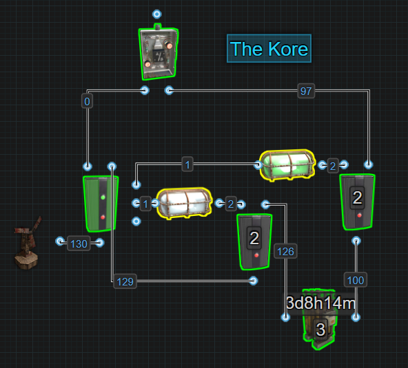
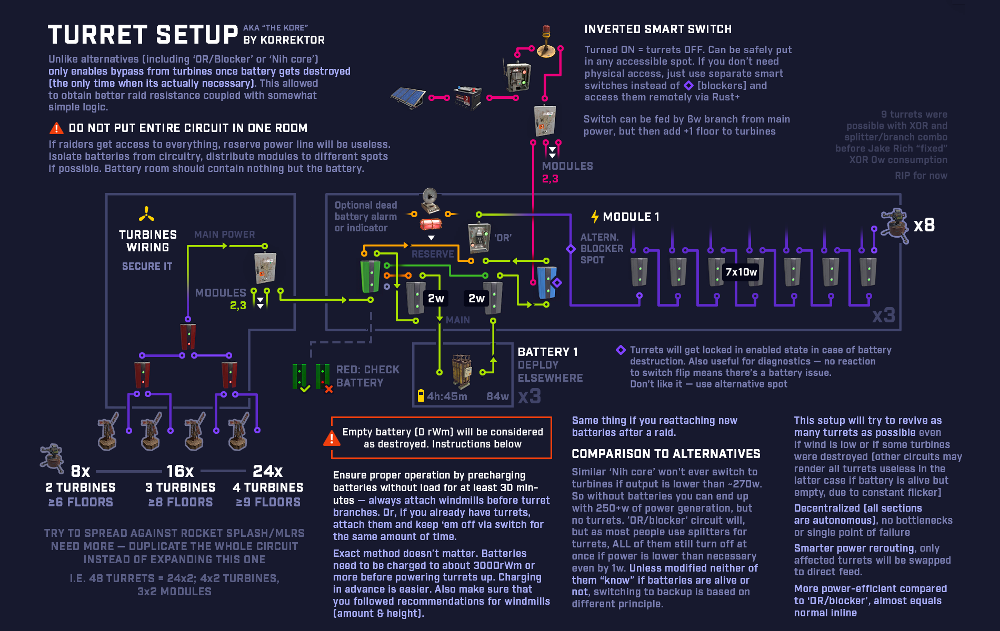
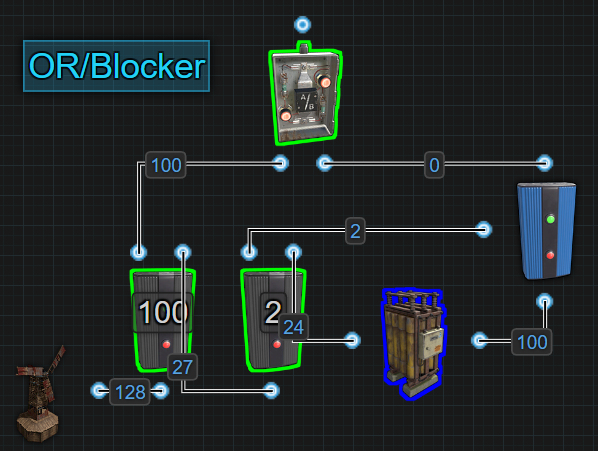
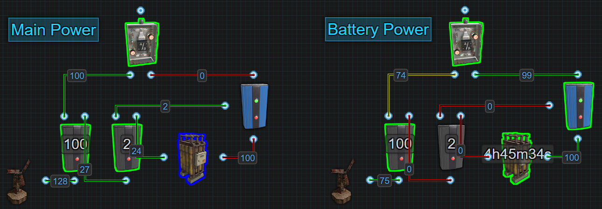
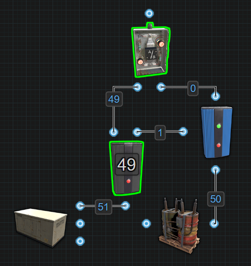
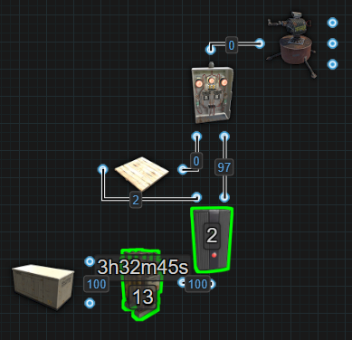
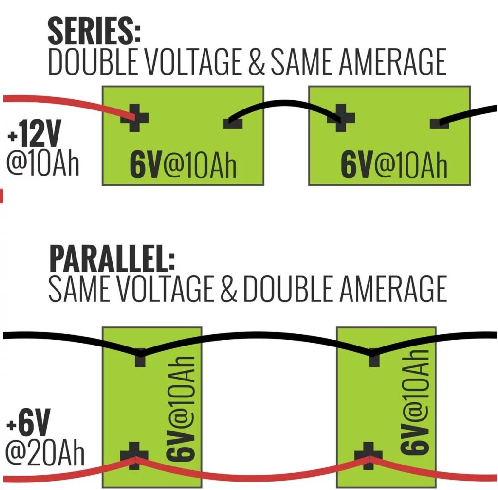
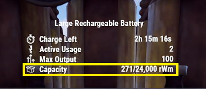

# Power Storage

TL:DR
- Batteries can accept incoming power at the same time they are sending power out.  
- Charging rate is dependent on the amount of power coming in, with an efficiency of 80%.  

> *Example:* 20rW from a Solar Panel × 0.8 = 16rW usable through a battery.  

> *Example:* If your Medium Battery is supplying 16rW to a circuit, 16 ÷ 0.8 = 20rW is the minimum you want to give the battery so it doesn’t lose any charge.

- It is recommended to supply slightly more than you need if you want to charge the battery.  
- When you combine batteries with Root Combiners, they do not split the load as one would expect. They cannot see each other, so each battery tries to power the whole circuit.  

> For example, in a circuit with 2 root combined batteries supporting a load of 50, it would seem to make sense that 50 power divided by 2 batteries equals 25 per battery. Rustricity doesn't work like that and 50 power is taken from each battery and seen as Active Usage on both batteries. This means both batteries are draining at a rate of 50.  

This means when we get to circuits that need more than 100 power, all the batteries combined will show a max Active Usage, which is used to calculate how fast a battery drains.  
So if we are forcing batteries to max drain, then we might as well try to use as much of the power the combined batteries will provide.

When using a bypass battery backup like the [ Nih core ]( powerstorage.html#nih-core ),
Active Usage does not matter because the circuits are getting power from the main power source most of the time and not the battery.

- Rustricity has its own version of [Parallel and Series](powerstorage.html#parallel-vs-series) battery configurations.
- 1rw will charge a Large Battery in 34 IRL days.
- When a battery is depleted because it is not receiving enough power, no power is outputed until it charges up for a couple seconds before
outputting to the connected circuit. The battery still not receiving
enough power will deplete in a second and the process repeats.  
- If the circuit after a battery is turning on and off,
you do not have enough power charging your batteries.
- When they get picked up, they lose 25% HP but retain their current
capacity. This means if a large battery has a full charge, when you pick
it up and place it back down, it will still have a full charge.
- Batteries have something called Active Usage and components have
something called Power Consumption. Read about it in [Battery Active Usage vs Actual Power Consumed](powerstorage.html#battery-active-usage-vs-actual-power-consumed).

---

# Battery Backup

There are 3 types of battery backup systems. There are Inline Backups, there are Bypass Backups and then there are the Battery Checked Backups of both Inline and Bypass. Inline backups include the Inline while The Kore is Battery Checked. Bypass backups include the OR/Blocker and the Nih Core while the BCN Core is Battery Checked.  

Deciding which backup to use really comes down to preference. They each have their own pros and cons and some may argue that 1 is better than another in different situations. For example, if you only need to power a few turrets and are in a hurry, you might find the simplicity of the Inline backup works for you. Maybe you are working with 300rW to 1000rW and a dozen Windmills, you might find the efficiency of the Nih Core is preferred. Having a good understanding of the concept Active Usage Vs Actual Power Consumed will also help you decide on a backup. At the end of the day, as long as the battery backup you go with, works when you need it to work, that was the right backup to choose.

---

# Direct Delivery

This is when the power source is directly connected to a circuit. If the power source is destroyed or stops producing power for any reason, the circuit will go offline. This method is a great solution for short term uses like getting some auto turrets asap for your clan or getting some water pumps online early for a berry farm. While this method is good for a very short time to get an early game advantage, it is not recommended to rely on this method for any length of time. Introducing batteries to a circuit to create backup power is more suited for long term use.

Pros:

- Easy to wire
- Minimal components
- Early game advantage

Cons:

- If power source is destroyed the components turn off
- No backup power
- Short term use only

---

# Inline

This is called an Inline because power must pass through the battery before powering something. Inline batteries are the most common and easiest way to provide a battery backup. This method is fast to make and wire. It is reliable assuming enough power is being produced to keep the batteries charged. It is also an easy way to decentralize circuits. When a power source is directly connected to a battery, 100% of that power is used for the sole purpose of charging that battery. When a battery is fully charged, any power above what is needed to maintain the battery’s charge, is not being used, which we call wasted. 

Batteries are 80% efficient and have a mechanic called Active Usage. There is an entire section about this but for right now, to figure out how much power a battery must be given so it doesnt drain, take the Active Usage number and divide that by 0.8. Active Usage can be found by holding a Wire Tool and looking at a battery. 

> For example, a large battery with an Active Usage of 100. 100 ÷ 0.8 = 125. Therefore, 125rW needs to be provided to prevent the battery from draining. 

If the battery is being given 150rW so it charges, when it is fully charged, there is 25rW of power that is not being used. When it needs to be charged, that 25rW is better then 1rW because it will charge faster. Giving a Large Battery only 1rW, it will take roughly 34 IRL days to fully charge. For 1 battery, 25 extra doesn't seem like a lot, but when using 4 or more batteries, that can be 100rW of power being “wasted”. 

One of the biggest benefits of an Inline backup is when the power source stops making enough or any electricity, the battery will continue to supply power, uninterrupted. This means that unlike bypass backs, the inline is not prone to a flicker off/on when the power source is not producing enough power. The battery will continue to power the circuit until it is depleted or destroyed. 

It is recommended to start charging batteries as soon as possible. Let them charge to a minimum of 3000rWm before letting them power anything. The reason for this is if a Wind Turbine is used, the wind could be entering a slow period. When using Solar Panels, night comes once an hour. Having some capacity saved up will help get through the slow or no times.

Recommended reading:

- [ Battery Active Usage vs Actual Power Consumption ](powerstorage.html#battery-active-usage-vs-actual-power-consumed)
- [ Short Circuit / Max Depth ](powerdistribution.html#short-circuit-max-depth)
- [ What is a Power Bus? ](powerdistribution.html#what-is-a-power-bus)

Pros:

- Simple to make with minimal electrical components
- Easy for decentralizing circuits
- No flicker (circuits turning off and on like a bypass backup)

Cons:

- Inefficient use of power at large scale
- If the battery is destroyed, power from the source is wasted

---

# The Kore

This is an upgraded Inline battery backup. It is a battery checked Inline backup, aka The Kore. Just like the traditional Inline, power from the main power source is used to charge the battery. The battery still powers the circuit all of the time just like an Inline backup, but if the battery gets destroyed, The Kore will switch over to the Wind Turbine or main power source. This is a huge advantage over the traditional Inline. 

As The Kore is using an inline battery, paying attention to Active Usage is required. Active Usage can be found by holding a Wire Tool and looking at the battery. There is a section that goes into detail about Active Usage but for now, just know that the amount of power an inline system needs is the Active Usage number ÷ by 0.8 (or Active Usage number × 1.25). This is because batteries are 80% efficient. The number that is given from doing this math is the minimum amount of power the battery will require to not drain. Adding more than that number allows the battery to charge. 

The way this system works is by sending power to a Memory Cell first. The left output, `Inverted Output`, is connected to an OR Switch that connects to a circuit. Power moves through the right side output, `Output`, to an Electrical Branch. 2 power is branched off to `RESET` on the Memory Cell and the rest is used to charge the battery. Power from the battery is sent to an Electrical Branch where 2 is branched off to ‘SET’ on the Memory Cell and the rest is sent to the OR Switch which powers the circuit. Due to how side inputs on the Memory Cell work, while `SET` is getting power, it will always send power through the right side output. If the battery is destroyed, power is removed from `SET` while power is still going to `RESET` which causes the Memory Cell to flip outputs. This allows the attached circuit to still receive some power which is better than no power.  

The biggest advantage of this backup system is the ability to continue to send power to the circuit even after the battery is destroyed, no matter how much power is coming in. It is recommended to let the battery charge to a minimum of 3000rWm before letting it power anything providing a buffer when entering a low power protection period of time.  

Recommended Reading:  

- [ Battery Active Usage vs Actual Power Consumption ](powerstorage.html#battery-active-usage-vs-actual-power-consumed)
- [ Short Circuit / Max Depth ](powerdistribution.html#short-circuit-max-depth)
- [ What is a Power Bus? ](powerdistribution.html#what-is-a-power-bus)

Pros:  

- Minimal electrical components  
- Has a built in backup  
- Easy for decentralizing circuits  

Cons:

- Inefficient use of power at large scale  
  

Check out the [demo here](https://streamable.com/ugrbkl)

---

# OR/Blocker 

This method has been around for a long time and is often called ‘Infinite Power’. It is not infinite power, it is just a bypass battery backup. It has been carried over from a previous version of electricity when batteries could only charge or discharge, not both at the same time. During this time batteries did not have an Active Usage and forced out max power causing the need to invent the ‘Infinite Power Loop’, which actually was something, but it was not this circuit. 

This is an OR/Blocker battery backup. It is a bypass battery backup that powers a circuit most of the time from the main power source. Power is bypassing the battery to power the circuit, while the excess power is used to charge the battery. When not enough power is produced, it will automatically switch on the battery keeping everything powered. The reason it is now considered out of date is because it doesn’t take advantage of the batteries ability to charge and discharge at the same time. 

The way this method works is by sending power into the first Electrical Branch and branching out enough power to meet a circuit's needs. That power is passed to an OR Switch which sends power to a circuit. The extra electricity from the first Electrical Branch is sent to another Electrical Branch. Power is branched out to block the Blocker which prevents the battery from draining. The extra power is then used to charge the battery. When there is not enough power to keep the battery blocked, the battery sends power out to the OR Switch to keep the circuit online. 

Based on the picture below, green wire showing what has power, red showing no power and yellow showing wasted power. If the Windmill only produces 75 power, it is not enough power to meet the demand of the first
 

Electrical Branch or block the battery. The battery takes over powering the circuit but the 75 power is still coming out of the first Electrical Branch. The power is still there, it is just not being used, it is wasted. 

While considered out of date today for use as a primary battery backup system, with some small modifications, it is useful as a secondary battery backup which we talk about in its own section. 

Pros:

- Easy to understand
- Simple to build

Cons:

- Wasteful when using battery power
- Ignores the battery update to allow charging and discharging at the
  same time

---

# Nih Core 

The Nih Core is the modern version of, and replacement for, the OR/Blocker. When using an inline battery to power a circuit, there is a 20% loss due to the batteries inefficiency. Bypass battery backups, like the Nih Core, are a way around this. Instead of a circuit being powered by the battery, the circuit gets power directly from the Wind Turbine while the battery gets charged with the excess. The Nih Core will automatically switch over to the backup battery when the power source is not producing enough. 

The Nih Core becomes more efficient the more batteries it has but there is only 1 in the picture because it's all that is needed to demonstrate how the Nih Core functions. The simple explanation is when there is not enough power to meet a circuit's requirements, it redirects the insufficient amount of power to the battery and activates it to take over powering the circuit. The reason the Nih Core becomes more efficient with more batteries is because we are bypassing the 20% hit from an inline battery and we don’t care about the battery’s Active Usage. We are bypassing the battery therefore removing any restrictions or conditions caused by it. Check out the section called ‘Battery Active Usage Vs Actual Power Consumed’ for an in depth explanation.

Using the following picture, it is possible to see where power exists and where it doesn’t when the Nih Core is running off of Main Power vs Battery Power. The green wires have power and the red wires do not.

To understand how this works, becoming familiar with the Memory Cell and the Splitter will help a lot. The inputs on the side of the Memory Cell are prioritized from top to bottom and when the Splitter receives power, it sends out power from left to right. This also applies to when Splitters lose power, they stop sending power out from left to right. The section ‘Circuit Delay and Power Flow’ helps explain in detail how rustricity moves around a circuit.

Based on the picture above, if the windmill only produces 75rW of power, it is not enough power to meet the demand of the first Electrical Branch, which is set to 100. That first Electrical Branch will still send that 75rW to the Memory Cell. This means no power is going to the second Electrical Branch, therefore the Splitter loses power. When the Splitter loses power, Output 1 first stops sending power to SET on the Memory Cell. At that moment, power from Output 2 is still going to RESET, so the Memory Cell flips outputs. RESET loses power followed by Output 3 going to Block Passthrough on the Blocker. The battery then takes over powering the circuit. The 75rW of power that is still going through the first Electrical Branch and Memory Cell, is now sent to the battery extending its life instead of being wasted. This will take a 4 hour backup time and extend it.

Here is a look at a Nih Core with 4 batteries. Keep in mind Max Depth
when using large numbers of power sources and batteries. 16 power sources and 16 batteries is the most you can connect
before hitting the Max Depth. Check out the section ‘Short Circuit / Max
Depth’ for an in depth explanation on that subject.

If you notice that power is flickering off/on when switching between
main power and battery power, it is because 1 of 2 issues.

**Solution 1 -** If using only 1 battery, add a Root Combiner between the battery and blocker to keep the battery active. If the battery does not have something registering Active Usage, it will enter an inactive state. This causes a delay when switching on to battery power waiting for the battery to wake up. 

**Solution 2 -** If already using a Root Combiner or using more than 1 battery, add 1 or 2, maybe even 3 components between the Memory Cells ‘Output’ and the OR Switch. This will hold power here longer giving the circuit a chance to receive power from the battery.

**Solution 3 -** Use a secondary inline battery backup to buffer against the flicker on circuits that need stability. In the picture below, the purple wires are representing a destruction detection system on some walls. Then the flicker happens, the Smart Alarm gets triggered. Adding the battery prevents that from happening. It does cost 20% more power for that circuit because of the battery, but it is 100% stable. The yellow wires represent circuits that do not need 100% stability. It could be deemed acceptable if these circuits turn off and on once in a while.

Recommended reading:

- [ Battery Active Usage vs Actual Power Consumption ](powerstorage.html#battery-active-usage-vs-actual-power-consumed)
- [ Short Circuit / Max Depth ](powerdistribution.html#short-circuit-max-depth)
- [ Circuit Delay and Power Flow ](powerdistribution.html#circuit-delay-and-power-flow)

Pros:

- Less wasted electricity when on battery
- Utilizes the battery’s ability to charge and discharge at the same
  time

Cons:

- More components, more wiring.
- Added complexity
- Power flickers when changing states

---

# BCN Core

The BCN Core is a Battery Checked Nih Core.....

---

# Secondary Battery Backup

A secondary battery backup is used to provide power to a circuit after the main backup system goes offline. It's a backup of a backup. The chance that a secondary backup battery gets used on a typical day is near 0%, so why use them? Why not? The only drawback is the increased power cost. More backups and redundancy never hurts functionality, it only adds to it.

There are a couple of different versions of the secondary backup. Just like primary battery backups, there is the inline and the bypass. Secondary backups can be built into any place in any circuit. 

The first and easiest way is installing an inline battery between a circuit and its power bus. Let's use a picture to illustrate a circuit that is using a Nih Core as a primary battery backup with Inline batteries for the secondary backup.

  

The secondary batteries are installed between the Electrical Branches and what the branch is providing power to. In the case of the Auto Turrets, instead of the Electrical Branch sending power straight to the Smart Switch, the branch sends power to a battery that then powers the switch and all the turrets. It’s the same for the SAM Sites. Power from the branch powers a battery and the battery powers the SAMs. Remembering that batteries are only 80% efficient, the amount of power each Electrical Branch provides is increased to compensate. With a secondary battery, the branch sending power to the turrets is set to 115. Without the secondary, it only needs to be set to 99. That's a 16rW  difference. The branch sending power to the SAM Sites is set to 96 but without the secondary battery, it only needs to be set to 76. That's a 20rW difference. For a total cost of 36rW, both the turrets and the SAMs will have a runtime of 8 or more hours if the main power source is completely destroyed. 

Another thing that should not be forgotten is that it takes 34ish days, or over 800 hours, to charge a large battery with  only 1rW. In other words, precharging secondary batteries should be a requirement. Once a battery is fully charged, providing it with any more then exactly what it needs to not drain, is wasted power that could maybe be better used elsewhere. The maximum input a battery can accept is 4x its output. That means 400rW could be sent to a large battery and have it fully charged in approximately 1 hour 15ish minutes.

The inline secondary battery is the easiest but paying the 20% tax for the battery can make this version not so attractive. So let’s have a look at a bypass secondary backup which has a static tax of only 3rW. This is essentially an OR/Blocker backup except the battery gets installed precharged and there is no built in way for it to be recharged. Let’s use the picture below to help illustrate how it works. 

The Test Generator represents static power coming from your main battery backup system. This means power levels won’t go up or down like wind and solar. When the Electrical Branch loses just 1rW, the battery will take over. What is more likely is that power will either be present or it will not. This battery should never be used so there is no built in recharging system. This saves wasting power recharging a battery that will probably never be used so it must be precharged. 

This secondary backup gets installed just like the inline version, between the circuit and its power bus. The picture below illustrates the same circuit as before using a Nih Core as a primary battery backup but now with a bypass battery for the secondary backup.

  

The secondary batteries are installed between the Electrical Branches and what the branch is providing power to. In the case of the Auto Turrets, instead of the Electrical Branch sending power straight to the Smart Switch. Power is sent to another Electrical Branch that blocks passthrough on a Blocker before sending a specific amount of power on an OR Switch. From there, it’s on to the Smart Switch and all the turrets. It’s the same for the SAM Sites. Power from the branch goes to another Electrical Branch that blocks a Blocker before sending power to an OR Switch. From there it's off to power the SAMs. 

The ability to bypass the battery means the amount of power each Electrical Branch provides only needs to be increased by 3rW to compensate. With a secondary battery, the branch sending power to the turrets is set to 98. Without the secondary, it only needs to be set to 95. That's a 3rW difference. The branch sending power to the SAM Sites is set to 79 but without the secondary battery, it only needs to be set to 76. That's also a 3rW difference. For a total cost of only 6rW, both the turrets and the SAMs will have a runtime of 8 or more hours if the main power source is completely destroyed.

Adding a recharging system can be done. It is just the OR/Blocker battery backup. The only drawback is the added power cost. If a player is OK with that, then go for it. 

Pros:

- Uses only a few components so it's easy to build and wire
- Can be efficient for redundant backup power
- Can be inserted into almost any circuit at any point

Cons:

- Requires a pre charged battery
- Added costs for redundancy  

---  

# Battery Active Usage VS Actual Power Consumed

Simply put, Active Usage is what a battery uses to calculate its charge
and discharge rate. Power consumed is the amount of power a component
requires to operate. Active Usage doesn't always = Power Consumed. This
is also where the argument of Electrical Branch vs Splitter comes from.
Once you understand this section, you will know the answer to this
age-old argument.

When you look at the battery with a wire tool, you will see Active
Usage. Active Usage is the amount of power the battery is draining by.
This is the number you want to use when calculating how much power to
give a battery for it to remain charged based on the battery's 80%
efficiency. Active Usage ÷ 0.8 or Active Usage × 1.25 gives you the minimum power input to remain neutral.

It is reasonable to think that the number you see is the amount of power
your circuit is currently consuming, but it’s not always the case. Even
when some components are turned off and not consuming power, they can
still add to a battery's Active Usage. In this next picture, even though
the Auto Turret is not consuming power, it is still adding to the
battery’s

Active Usage and in fact, it will actually consume 14 power. In this
case even though the AND Switch is not allowing power to pass through,
it does not have the ability to hide the Active Usage from inactive
components downstream or past it. In this next picture, if we use
different components to achieve the same outcome, we can hide

the Auto Turret’s Active Usage from the battery when it is not consuming
power. This setup reduces the Active Usage all the way to 6. When
active, we will get an Active Usage of 16
but it will actually consume 18.  
Components like Switches, the Blocker, Timer and RF Transmitter all
have the ability to hide a component's Active Usage from batteries when
not passing power through.

Every component will only register an Active Usage once and equal to the
amount of power it consumes with the exception of the Electrical Branch.
Only the Branch Out value will register Active Usage even though it does
consume 1 power for itself. An Electrical Branch set to 2 will register
an Active Usage of 2 but will consume 3. Branch Out is a FIXED value.
The thing to remember is that it is the Branch Out value that is
registering Active Usage, not the components connected to Branch Out.
This means that the components connected to Branch Out, even though it
is where they are getting their power from, their Active Usage is not
what is registering on the battery. If there is another path that lets
the battery see these components, it is possible for their Active Usage
to register on the battery along with the Branch Out value, effectively
doubling the power needed. This next picture is a quick example to show
how a Boom Box that is powered from Branch Out, but using a Switch to
Toggle Play on and off, is registering 10 Active Usage for the Branch
Out, 1 for the Switch and 10 for the Boom Box. If we do the same thing,
but with the Splitter, we dont have this issue because the Splitter
controls its power flow DYNAMICALLY.

This is helpful in situations where you have a few small 
circuits where you dont want to force an Active Usage when the circuits
are off. Now because the Electrical Branch only registers the Branch Out
value as Active Usage and 0 for itself, we can trick batteries into
thinking less power is being consumed. In the next picture, we have some
examples using Auto Turrets.

Above, we have 1 example using 8 Electrical Branches to power 9 Auto
Turrets. Every branch is outputting 10 power but also consuming 1 power
for itself. So in total we are consuming 98 power but the battery’s
Active Usage is only 90. The 2nd example we are using 4 Splitters to
power the same number of turrets only this time the Splitters are
consuming 1 and have an Active Usage of 1 each. This gives us an Active
Usage and Power Consumption of 94. The example with Electrical Branches
only has 2 extra power meaning there is enough power available to add a
single Ceiling Light while the 2nd example has 6 extra power, that’s
enough power for 3 Ceiling Lights.

In the situation where an Inline Battery is being used, you want to
minimize the battery's Active Usage to minimize the cost of power
production. Like in the single Auto Turret examples above, there is a
required input power difference of 9rW just to maintain the battery.
Batteries are 80% efficient. Take the Active Usage number and divide it
by 0.8. This will give you the minimum amount of power required to
maintain the battery and it will not drain. It wont charge either. The
more power above the minimum, the faster the battery will charge but the
more you will waste when the battery is full. 1rW will charge a large
battery but it will take 34 IRL days.

In a bypass system like the Nih Core, Active Usage doesn't matter
because you are not relying on the battery as a main power source. You
are bypassing the battery. This means that the amount of power consumed
is more important. If we look at the above picture again with the 9 Auto
Turrets, we can see that while both examples are accomplishing the same
goal, 1 is consuming less power then the other. If we look back at the
single Auto Turret examples, the 1st example with an Active Usage of 13
will actually consume 14 vs the 2nd with an Active Usage of 6 will
actually consume 18. So while the 1st example is bad on an Inline
system, it is better in a bypass system. The less power you can use to
do something, gives you more power to do other things.

You can use a bypass system with 1 Large Battery and only use 50 power
to double the life of the battery but, it is more common to see a bypass
system used for 2 or more batteries to get a larger output. If we are
using 2 or more batteries to get the higher output, a Root Combiner will
be used. The moment we combine batteries to power a circuit that uses
more than 100 power, both batteries will have an Active Usage of 100.
This is because load sharing is not a thing in Rustricity. If the
circuit only needs 50, both batteries will have an Active Usage of
50(plus 1 for the Root Combiner).

Due to this being the way it is, if you combine 2 batteries to get 200
power, try to use all 200 because no matter if the circuit needs 101 or
199, 2 large batteries will only last 4 hours. If they are only going to
last 4 hours regardless, try to use as much of that 200 as possible to
make it worth combining the batteries. Otherwise, split the circuit, run
Inlines and minimize the Active Usage.

Now, having said you want to consume as little power as possible to
achieve the desired outcome when using a bypass battery backup, there
are times when it is worth consuming more for a bit of added security.
In the next picture, Ive used medium batteries for the demonstration,
and they are root combined powering some Auto Turrets.

The top groups are using Electrical Branches. They are consuming more
power but in the event 1 battery is destroyed, top right, some turrets
stay active. The bottom groups use Splitters. While they do consume less
power, in the event a battery is lost, very bottom, all the turrets go
offline. You will need to weigh the pros and cons and decide what is
right to fit your needs. Read more in What is a Power Bus? 

# Parallel vs Series
Lets start by learning what Parallel and Series means in real life. Connecting batteries in series increases voltage and connecting batteries in parallel increases capacity.   

V = Volts (power)  
Ah = Amp hour (capacity)  

If we wire two 6V@10Ah batteries in parallel, we will still only have 6V but have 20Ah of capacity.  
If we wire two 6V@10Ah batteries in series, we will now have twice the power at 12V but with only 10Ah of capacity.  

In real life, batteries have positive (+) and negative (-) connections. In Rust, our batteries only have 1 input and 1 output. We also measure our Volts (V) as Rust Watts (rW) and our capacity, instead of Amp hours (Ah) we use Rust Watt Minutes (rWm).

In Rust, a large battery can give 100rW of power and has a capacity of 24000rWm. The outcome of wiring 2 large batteries in series would be 200rW of power with a capacity of 24000rWm. The outcome of wiring 2 large batteries in parallel would be 100rW of power with a capacity of 48000rWm.

## Series

To wire large batteries in series in Rust, just use a Root Combiner. The output will be 200rW and because both batteries will drain at the same, the total capacity will remain at 24000rWm. This will give a mimimum runtime of 4 hours.

Wiring more than 2 batteries into series is not much more complicated. Just add more Root Combiners. This will provide more power for consumption but the capacity will remain the same. For more information as to why the capacity stays the same, it is recommended reading [ Battery Active Usage vs Actual Power Consumption ](powerstorage.html#battery-active-usage-vs-actual-power-consumed) in the Power Storage section under Concepts. 

It is recommended to charge all the batteries wired in series at the same rate. This will help keep power levels equal across all batteries. For example, if there are 2 batteries in series and 1 of them drains empty, 50% of the circuit will go offline because 50% of the power is gone. However, giving priority to 1 battery in series could be a design feature.

## Parallel

To wire 2 large batteries in parallel requires a few more components. 1 battery needs to block the other battery to prevent both from draining at the same time. The output is only 95rW because of the extra components but the capacity will be doubled to 48000rWm. This would provide a minimum runtime of 8 hours.

While this technically works for paralleling 2 batteries, consider using a secondary backup instead. 2 parallel batteries costs 5rW but a bypass secondary backup could cost as little as 2rW. This can also be true no matter the number of secondary batteries if there is no built in recharging. If recharging a secondary battery is built in, it adds a minimum of 2rW per battery to the power cost. Check out the section for [Secondary Backups](powerstorage.html#secondary-battery-backup) in Power Storage under Concepts.

Going beyond 2 batteries and tripling the capacity, things get a little more complicated.

---

# Nih Capacitor

**( will probably be fixed soon and wont work anymore )**

The Nih Capacitor was first established by Nih, with assistance from SwiftCoyote, on September 11, 2022.
A Capacitor is a set of components that accumulate power, much like rechargeable batteries.
However, the method for assessing the amount of stored power differs. 

For batteries, the stored power is represented as `Capacity`,  
measured in Rust Watt Minutes (rWm).

Contrarily, in a Capacitor, we gauge the power storage by examining an Input/Output (IO) connection
and observing a figure that is typically associated with `power` or the amount of power available for use.  
But within the Capacitor, this figure **DOES NOT indicate the amount of power that can be utilized**.
Rather, this figure is what we call `Wire Capacity`, symbolized as `Np`.
For instance, in the image below, the displayed `6,492,076` is **NOT** the amount of power available.
Instead, it represents `6,492,076Np` of Wire Capacity. 

Before going into the construction and operation of a Capacitor,
it’s essential to understand the math conversions between Rust Watt Minutes (rWm) and Wire Capacity (Np).  

Both represent capacity, but they use different units of measurement depending on the energy storage container, be it a battery or a capacitor. 

**The Maths:**  
`rWm :` rust watt minutes (capacity)  
`rW :` rust watts (commonly referred to as "power")  
`Np :` Wire Capacity  
`∅ :` 7.5 (Trust Me Bro)  
`S :` Seconds  
`τ :` 60 (The number of seconds in a minute, and minutes in an hour)  
`M :` Minutes  
`P :` Max power output for 1 second  
`O :` The amount of power you want to output  
`H :` Hours  

To convert rWm into Wire Capacity(Np), use the following equation:  
`(rWm × τ = P) × ∅ = Np`

To convert Wire Capacity(Np) into rWm, use the following equation:  
`(Np ÷ ∅ = P) ÷ τ = rWm`

To figure out how much time a given capacity will run for outputting a specific amount of power, use the following equations:  
`Seconds: (rWm ÷ O = M) × τ = S`  
`Minutes: rWm ÷ O = M`  
`Hours: (rWm ÷ O = M) ÷ τ = H`  

**Examples**  
Using Capacity from the battery in the first picture, it is possible to figure out the number that would be seen if looking at an IO connection in a Capacitor to view Wire Capacity(Np).  
`(rWm × τ = P) × ∅ = Np`  
`(271 × 60 = 16,260) × 7.5 = 121,950Np`  

Therefore a capacity of 271rWm when viewed on an IO connection is equal to 121,950Np.
We can also see that if the Large Battery did not have an output limit of 100,
it would be able to output 16,260rW of power for 1 second. 

Using the IO connection to view Wire Capacity(Np) from the second picture,
it is possible to figure out how much rWm of Capacity we would have if this was viewed on a battery.  
`(Np ÷ ∅ = P) ÷ τ = rWm`  
`(6,492,076 ÷ 7.5 = 865,610.1333) ÷ 60 = 14,426rWm`  

Therefore a Wire Capacity of 6,492,076Np when viewed on a battery represented as Capacity, it is equal to 14,426rWm.  

Without a limited output, the Capacitor is capable of delivering 865,610rW of power for 1 second. 

Using both of these examples, it's possible to calculate the length of time both the Battery and Capacitor would power a circuit for,
given a set output.
> For our example, let's say the circuit needs 100 power.  

Battery :  
  `(rWm ÷ O = M) × τ = S`  
  `(271 ÷ 100 = 2.71 Minutes) × 60 = 162 Seconds`  

Capacitor : *(you will need to convert from Np to rWm first)*  
  `(rWm ÷ O = M) × τ = S`  
  `(14,426 ÷ 100 = 144.26 Minutes) × 60 = 8,655 Seconds`  

OR :  
  `(rWm ÷ O = M) ÷ τ = H`  
  `(14,426 ÷ 100 = 144.26 Minutes) ÷ 60 = 2.40 Hours`  

Prior to constructing a capacitor, it’s crucial to understand its limitations and potential issues.
This will clarify misconceptions such as the notion of ‘infinite power’ and help identify the appropriate contexts for its use.  

- It doesn’t survive server restarts. evrytime the server restarts, all of the stored power will vanish, poof gone.  
- When automating energy extraction, it is possible that a flicker will be created or worse, all the power vanishes, poof gone.
- It consumes power even when nothing is connected to it, unlike a battery that doesn’t lose power if nothing is connected to it.
- It is not portable.

Now, some of the advantages and benefits of the Capacitor

---

That wraps up this section. I hope I have explained things in a way that makes sense. Please comment on the [Google Doc](https://docs.google.com/documentd19hr2dKtooN_YDF7TUsTdpLGadEEy9iyEFp12wbPnIas/edit?usp=sharing) if you have any suggestions or questions.