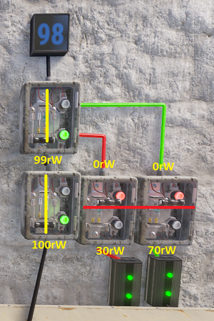
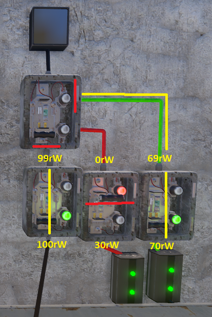
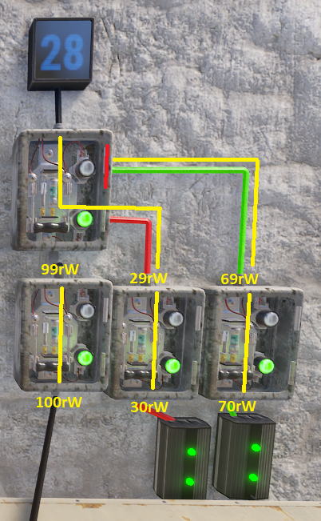
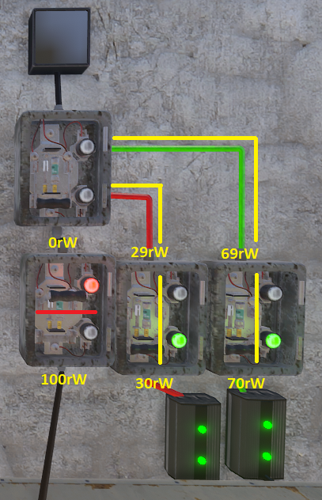
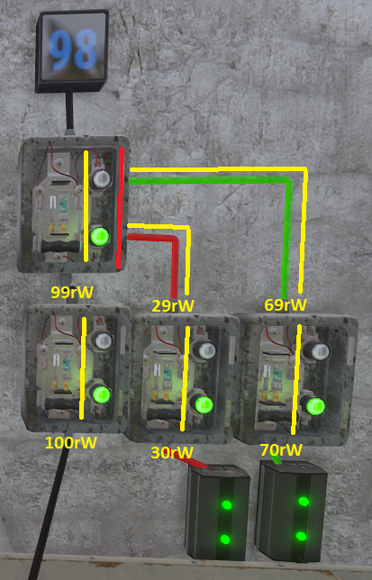

# Uncategorized Concepts

## Side Inputs
They are not bugged or broken, you just don't know how to use them yet.

It is not uncommon for people to think of ‘Switch On’ and ‘Switch Off’
as a toggle like on the side of a Timer. They are not toggles, they are
inputs with an added function. Just like the ‘Power In’ on the bottom,
the side inputs also pass power through to the top. The function part
only functions when power is received, removed or the amount of power is
updated.

When ANY input on the Switch receives an "update", the Switch will bind
to that input for its source of power that passes through to the top. It
will remain bound to that input until another input "updates" which will
force the switch to bind to the new input. An update is either losing
power or receiving power, 0-1 or 1-0 or power levels change up or down.

The exception to this is when one input is receiving an amount of power
and another input receives the same amount of power, the Switch will not
recognize the new source and remain bound to the original input.

The following pictures will help illustrate how it works.

Starting off, we are using 3 Switches to provide 3 different amounts of
power each input. Green wire is for Switch On. Red wire is for Switch
Off. Black wire is for Electric Input on the bottom. Yellow lines mark
the path power is taking. Red lines mark where power stops. In this
first picture, we are sending power to the bottom input and the Switch
sends it out the top, with the expected power loss.

Next, we leave power going into the bottom and then apply power to
Switch Off. As we can see, the Switch will flip
off.

If we manually flip the Switch back on, we can now see a new amount of
power displaying on the counter.

This is because the Switch is now bound to the Switch Off input for the
power that passes through to the top. The power going into the bottom
input is completely ignored. For the next picture, we flip the Switch
back off and then apply power to Switch On.

The Switch will now flip on and once again pass through a new amount of
power to the counter. The power going to the bottom input or Switch Off
input is now ignored and the Switch is bound to Switch On. In the next
picture, we remove power from Switch On while keeping power applied to
Switch Off and the bottom.

We can see here now that power was removed from Switch On, the Switch
has no power. The green light turns off and the Switch is still in the
on position. Even though the other 2 inputs have power, the Switch is
bound to Switch On for its source of power, which was removed. If we
restore power to Switch On, the Switch will start passing power though
again like the previous picture. With power restored, for the next
picture we will remove power from Switch Off.

We restored power to Switch On before removing power from Switch Off.
The green light turns off when power is removed and the Switch binds to
the Switch Off. This is because that input received an update from
‘having power’ to ‘not having power’, from 1 to 0. For the next picture,
we restore power to Switch Off.

Restoring power to the Switch Off input, the red light turns on and the
Switch flips to the off position. When we manually flip it on we can see
the new amount of power passing through.

Seeing that we only have 28 power showing on the counter, it is clear
power is coming through the Switch Off input. When we remove power from
the bottom input, the Switch loses power.

It loses power because the bottom input was updated, from 1 to 0, so the
Switch bound to it. Now bound to the bottom input and not receiving
power, the green light turns off and no power passes through. Restoring
power to the bottom input, the green light turns back on and the new
power amount is displayed on the counter.

Seeing the power level on the counter confirming power is coming into
the bottom, we will now adjust the Electrical Branch to send more power
to Switch On.

After increasing the amount of power, we can see an instant change on
the counter to reflect that the Switch changed the input it was bound to
from the bottom input to Switch On.

In conclusion, whichever is the last input to receive an update is the
input the Switch will bind to for its source of power. Adding power,
removing power or a change in power levels will update the Switches
input. When moving power from one input to another, it is important

---

## Smart Timer

Needs work

---

## Monuments Camera Codes

- Abandoned Military Base codes:  
`COMPOUND****`  
`OUTDOOR****`  
*Locate the computer station inside the monument, underground, and access it
  to find the randomly generated codes for the cameras.*
- Airfield camera codes:  
`AIRFIELDHELIPAD`
- Bandit Camp camera codes:  
`CASINO`  
`TOWNWEAPONS`
- Dome camera codes:  
`DOME1`  
`DOMETOP`
- Large Oil Rig camera codes:  
`OILRIG2HELI`  
`OILRIG2DOCK`  
`OILRIG2EXHAUST`  
`OILRIG2L1`  
`OILRIG2L2`  
`OILRIG2L3A`  
`OILRIG2L3B`  
`OILRIG2L4`  
`OILRIG2L5`  
`OILRIG2L6A`  
`OILRIG2L6B`  
`OILRIG2L6C`  
`OILRIG2L6D`
- Nuclear Missle Silo camera codes:  
`SILOEXIT1`  
`SILOEXIT2`  
`SILOMISSILE`  
`SILOSHIPPING`  
`SILOTOWER`
- Outpost camera codes:  
`COMPOUNDCHILL`  
`COMPOUNDMUSIC`  
`COMPOUNDCRUDE`  
`COMPOUNDSTREET`
- Small Oil Rig camera codes:  
`OILRIG1HELI`  
`OILRIG1DOCK`  
`OILRIG1EXHAUST`  
`OILRIG1L1`  
`OILRIG1L2`  
`OILRIG1L3`  
`OILRIG1L4`
- Underwater Labs camera codes:  
`AUXPOWER****`  
`BRIG****`  
`CANTINA****`  
`CAPTAINQUARTER****`  
`CLASSIFIED****`  
`CREWQUARTERS****`  
`HALLWAY****`  
`INFIRMARY****`  
`LAB****`  
`LOCKERROOM****`  
`OPERATIONS****`  
`SECURITYHALL****`  
`TECHCABINE****`  
*Once inside an Underwater Lap, players will need to find a Keycard to open the Underwater Lab's CCTV Station Module since the final 4-digits of these Rust camera codes are randomly generated. With those 4-digits, players can now input the correct code to the corresponding CCTV camera.*

---